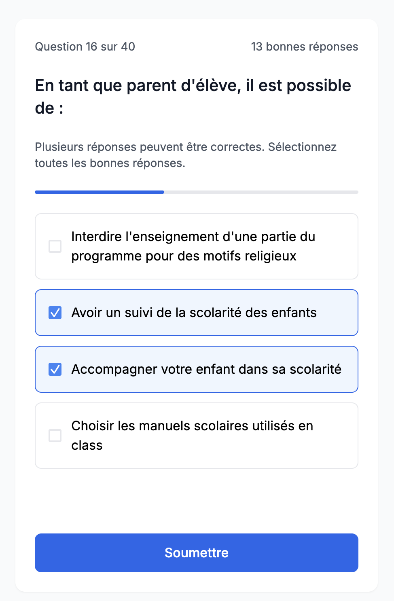

# Quiz de Naturalisation Française

Une application web pour tester vos connaissances civiques et évaluer votre préparation pour la naturalisation française.





## Caractéristiques

- **Quiz interactif**
- **Options**
  - Choix du nombre de questions avant de démarrer (10, 20, 40, 80)
  - Difficulté :
    - **Normal** : une seule réponse correcte est possible par question.
    - **Difficile** : plusieurs réponses correctes sont possibles par question.
- **Questions variées** : Questions sur le système institutionnel, les principes et valeurs, l'histoire, la géographie et la vie en France.
  - Les questions proviennent du document [Questions de connaissance pour l'examen civique de la demande de naturalisation](https://www.immigration.interieur.gouv.fr/content/download/138954/1097120/file/examen-civique-naturalisation-questions-de-connaissance-20251212.pdf) disponible sur le site du [Ministère de l'Intérieur](https://www.immigration.interieur.gouv.fr/Integration-et-Acces-a-la-nationalite/La-nationalite-francaise/Les-procedures-d-acces-a-la-nationalite-francaise).
  - La source des questions sur le site du Ministère de l'Intérieur contient les questions, mais pas les réponses. Les réponses présentes dans ce projet ont été partiellement renseignées manuellement et partiellement générées à l'aide de [Google NotebookLM](https://notebooklm.google/), en s'appuyant sur des sources issues de sites officiels du gouvernement français, par exemple :
    - [Le livret du citoyen](https://www.immigration.interieur.gouv.fr/content/download/138655/1095254/file/Livret-du-citoyen-accessible.pdf)
    - [Charte des droits et devoirs du citoyen français](https://www.prefecturedepolice.interieur.gouv.fr/sites/default/files/Documents/Chartedesdroitsetdevoirs.pdf)
    - [Le président de la République](https://www.elections.interieur.gouv.fr/comprendre-elections/pour-qui-je-vote/president-de-republique)
    - [Les conseillers départementaux](https://www.elections.interieur.gouv.fr/comprendre-elections/pour-qui-je-vote/conseillers-departementaux)
    - [Les conseillers régionaux](https://www.elections.interieur.gouv.fr/comprendre-elections/pour-qui-je-vote/conseillers-regionaux)
    - [Les parlementaires européens](https://www.elections.interieur.gouv.fr/comprendre-elections/pour-qui-je-vote/parlementaires-europeens)
    - [Les sénateurs](https://www.elections.interieur.gouv.fr/comprendre-elections/pour-qui-je-vote/senateurs)
    - [Élections législatives](https://www.service-public.gouv.fr/particuliers/vosdroits/F1943)
    - D'autres sources sur .gouv.fr.

## Installation

1. Cloner le repository :

```bash
git clone https://github.com/caarmen/qec
cd qec
```

2. Installez les dépendances :

```bash
npm install
```

## Utilisation

### Mode développement

Lancez le serveur de développement :

```bash
npm run dev
```

L'application sera accessible sur `http://localhost:5173`

### Build de production

Créez une version optimisée pour la production :

```bash
npm run build
```

Les fichiers de production seront dans le dossier `dist/`

### Prévisualisation du build

Prévisualisez le build de production localement :

```bash
npm run preview
```

## Tests

### Lancer tous les tests

```bash
npm test
```

## Développement

### Ajouter des questions

Modifiez le fichier `src/data/questions.json` :

```json
{
  "questions": [
    {
      "question": "Votre question ici ?",
      "theme": "Thème",
      "correctAnswers": ["Réponse correcte"],
      "wrongAnswers": ["Mauvaise 1", "Mauvaise 2", "Mauvaise 3"]
    }
  ]
}
```

### Linter

Vérifiez le code avec ESLint :

```bash
npm run lint
```

## License

Ce projet est sous licence MIT.
